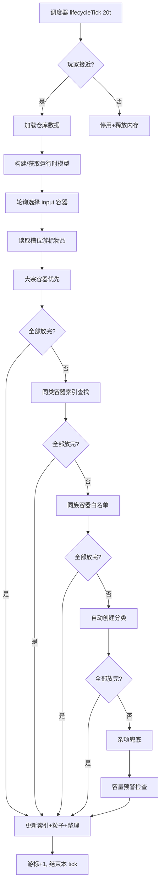
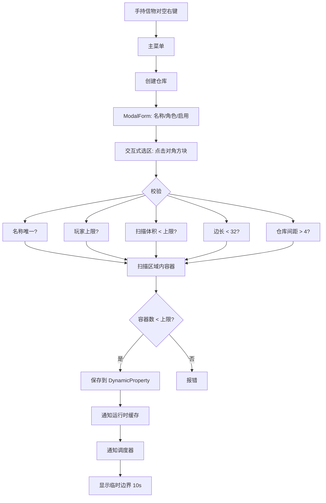
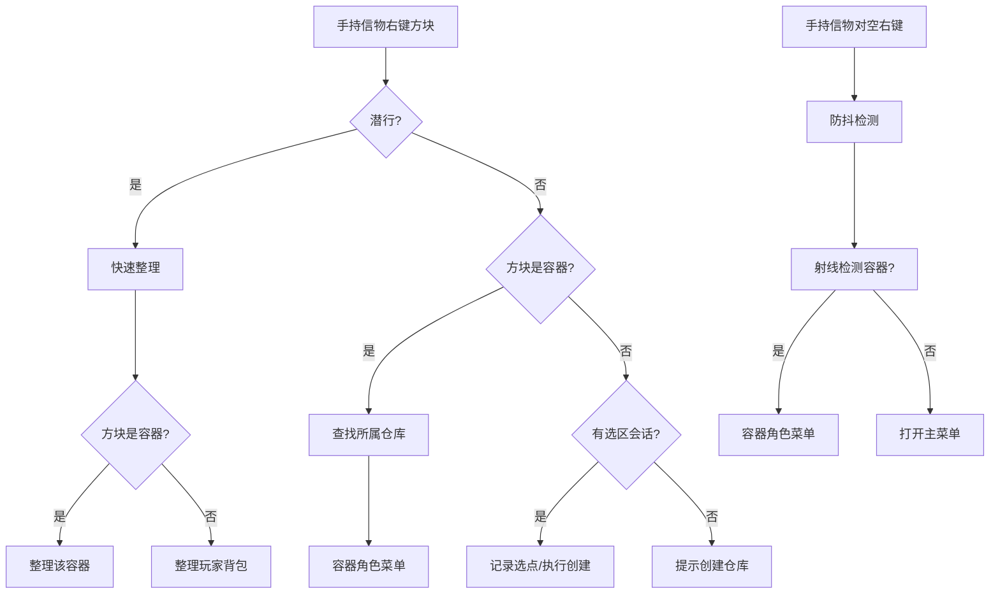

# SmartWarehouse 架构概览

> 版本: 0.0.54 | 最后更新: 2026-07-07
> 项目地址: https://github.com/YinxSmartHouse/SmartWarehouse

---

## 一、项目概述

SmartWarehouse 是一个 Minecraft Bedrock Edition 行为包（Behavior Pack）Addon，
基于 Script API（@minecraft/server）实现智能仓库管理。
核心定位是：**自动化物品分拣、容器整理与仓库管理系统**。

---

## 二、六大核心子系统

### 2.1 分拣引擎（SorterEngine）

**文件**: `scripts/sorting/SorterEngine.ts`

分拣引擎是整个模组的核心。它从输入容器读取物品，按五级优先级路由到存储容器。

**路由优先级（严格按此顺序）：**

1. **大宗容器（bulk）** — 专收单一类型大量物品，按箱内第一个物品种类匹配。空箱需玩家先放入一种物品来设定类型。数量极少（1~5），全量扫描无索引开销。
2. **已有同类物品的普通容器（normal）** — 利用运行时 `itemTypeIndex` 索引快速查找已有同类物品的容器。索引有自愈机制：发现空箱自动清理，索引全脏时零回合全量回退修复。
3. **同族物品容器（family）** — 仅当物品所属族在 `enabledFamilies` 白名单中启用时才生效。按家族纯度（家族物品类型数 / 容器总类型数）降序排列，优先放入最纯容器。
4. **自动创建分类** — 在 `autoCreateCategories` 开启时，找到第一个空 normal 容器作为此类物品的专用容器。放入后自动写入索引，后续同类物品走优先级 2 快速路径。
5. **杂项容器（misc）** — 最终兜底，所有无法放入上述优先级的物品最终流入杂项容器。

**分拣流程（每 tick）：** 轮询选择 input 容器 -> 读取槽位游标指向的物品堆 -> 按五级优先级遍历候选容器 -> Container.transferItem() 直接方块间移动 -> 更新索引 -> 播放粒子效果 -> 触发整理检查 -> 容量预警 -> 游标+1。

**容错设计：** 每个 input 容器处理在 try-catch 中，单个异常不影响其他容器；
区块未加载时静默跳过（40 tick 后重试）；分拣失败时 MoveJournal 回滚；
回滚也失败时停用仓库保留现场。

**关键类：**
- `SorterEngine` — 主引擎，processWarehouse / processInputContainer / sortFromContainer
- `MoveJournal` — 分拣事务日志，记录源槽位+目标容器快照，支持完整回滚
- `CapacityWarningService` — 三级预警，冷却防刷
- `SortingIndexManager` — 索引查找/自愈/全量回退

### 2.2 分拣调度器（SortingScheduler）

**文件**: `scripts/sorting/SortingScheduler.ts`

**核心设计：惰性生命周期管理。** 不再为所有仓库预先创建 runInterval，
而是通过全局监控 tick 按需激活/停用仓库。

**生命周期状态：**
- 停用（Inactive）: 无 interval、无运行时模型（内存已回收）
- 激活（Active）: 创建 interval + 运行时模型（按需 cold-start）

**监控流程（每 20 tick = 1 秒）：**
1. 刷新玩家位置缓存
2. 无玩家在线 -> 停用所有仓库，return
3. 遍历所有仓库：
   - 已禁用/已删除 -> 停用
   - 玩家接近 + 有 input 容器 -> 惰性激活（创建 runInterval）
   - 玩家离开+40 tick（2秒）-> 停用（释放内存）

**优点：** 无玩家在线时零 tick 开销；100 仓库共存时只活跃玩家附近的 N 个；
脚本启动时不创建任何 interval，真正的按需加载。

**关键接口：**
- `start()` / `stop()` — 全局调度启停
- `refreshOne(id)` — 刷新单个仓库（速度/启用变化时调用）
- `activate(id, speed)` / `deactivate(id)` — 单个仓库启停
- `activeCount` — 当前活跃仓库数

### 2.3 容器整理器（SlotOrganizer）

**文件**: `scripts/organize/SlotOrganizer.ts`

**三段式 API：**
- `analyze(container)` — 只读扫描，返回排序+合并后的物品列表 + 混乱度评分
- `apply(container, analysis)` — 写入容器，先校验 checksum，写入失败时回滚快照
- `organize(container)` — analyze + apply 一步到位

**混乱度评分模型（0~1，越高越乱）：**
- 顺序权重 70%：相邻逆序对（typeId localeCompare）
- 堆叠权重 30%：同种物品有 2 组以上未满堆叠记入未优化
- 适用于 `onDeposit` 自动整理阈值判断

**安全机制：**
- 写入前 checksum 校验（防止容器在分析期间被修改）
- 写入前全槽位快照（失败时完整回滚）
- 容器级写锁（100 tick 超时），防止分拣引擎同时整理

**集成点：** SorterEngine 每次成功放入物品后调用 `organizer.onDeposit()`，
计算该容器混乱度，超过阈值则自动整理。阈值在仓库设置页配置（0~100）。

### 2.4 仓库服务（WarehouseService）

**文件**: `scripts/warehouse/WarehouseService.ts`

**核心业务逻辑层**，提供仓库 CRUD 和容器管理。

**仓库 CRUD：**
- `createWarehouse()` — 校验 ID 唯一性、玩家上限、扫描体积、边长度、间距；扫描容器；写入存储
- `resizeWarehouse()` — 调整区域后重新扫描容器，过滤掉新区域外的容器
- `rescanWarehouse()` — 全量重扫，保留角色和发现时间，清理统计缓存
- `previewRescanWarehouse()` — 预览重扫差异（新增/移除/变化/未变）
- `deleteWarehouse()` — 清理统计缓存 + 存储 + 运行时 + 边界显示
- `renameWarehouse()` — 仅修改显示名，saveMetaOnly 优化

**容器管理：**
- `setContainerRoleAndState()` — 修改角色/启用/容量预警开关
- `updateSettings()` — 部分更新仓库设置，处理速度受全局限制约束

**增量更新：**
- `registerBlockMaintenance()` — 注册方块放置/破坏事件监听
- 放置容器 -> `addContainerToWarehouse()` -> 增量添加或合并（大箱子）
- 破坏容器 -> `removeContainerFromWarehouse()` -> 尝试拆箱或直接删除

**合箱/拆箱：**
- `mergeContainer()` — 新大箱子覆盖原单箱坐标，继承角色/启用/发现时间
- `splitContainer()` — 大箱子被破坏一半 -> 剩下的单箱继承原数据

**关键常量：** `MIN_WAREHOUSE_SPACING = 4`, `MAX_EDGE_LENGTH = 32`

### 2.5 运行时缓存（WarehouseRuntimeRegistry + WarehouseRuntimeModel）

**文件**: `scripts/runtime/WarehouseRuntimeRegistry.ts` / `scripts/runtime/WarehouseRuntimeModel.ts`

**缓存策略：** Map 缓存 + 脏标记。模型保留到显式删除或标记脏。
仓库总数受 maxWarehousesPerPlayer + 全局上限约束，内存可承受。

**运行时模型（WarehouseRuntimeModel）内容：**
- `containersById` — 容器 ID 映射
- `occupiedLocationIndex` — 坐标位置索引
- role 分桶列表 — input/normal/misc/bulk/disabled
- `itemTypeIndex` — 物品种类到容器列表的索引（分拣引擎核心性能来源）
- `familyTypeIndex` — 同族物品容器索引
- `inputCursor` — 输入容器轮询游标
- `inputSlotCursors` — 各 input 容器当前处理槽位
- `dirty` — 脏标记，触发重建
- `areaLoaded / areaLoadedCheckedTick` — 区块加载检测缓存

**重建时机：** 所有仓库数据变更操作都通过 `notifyDirty -> runtime.markDirty()` 通知，
下次 `getOrBuild()` 自动重载。

### 2.6 持久化层（WarehouseRepository）

**文件**: `scripts/storage/WarehouseRepository.ts`

**基于 Minecraft DynamicProperty 的仓储实现。**

**分片设计：** 每个容器分片最多 128 条记录，避免单条 DP 超限（约 32KB）。
分片键格式：`sw:warehouse:<id>:<gen>:containers:<shardIndex>`

**崩溃安全写入（save）：**
1. 递增世代号，新数据写入新分片键（旧数据不受影响）
2. 写 meta（指向新世代 + 容器计数）
3. 清理旧世代分片键
在任何步骤崩溃都不会导致数据不一致。

**写入模式：**
- `save()` — 全量写入（创建、重扫、调整区域），递增世代号
- `saveMetaOnly()` — 仅写 meta（设置变更），跳过容器分片
- `patchContainers()` — 覆写当前世代分片（高频小变更），不递增世代号

**字段迁移：** 自动用默认值补齐旧数据缺失的字段（如 enabledFamilies、capacityWarning）。

---

## 三、三个交互功能模块

### 3.1 搜索系统（SearchService + SearchUI）

**文件**: `scripts/warehouse/SearchService.ts` / `scripts/ui/SearchUI.ts`

**搜索流程：** 玩家输入关键词 -> ModalForm -> 通过 ItemNameMap 匹配 typeId -> 
遍历仓库容器扫描槽位 -> 按坐标排序 -> 聊天栏输出结果 + 紫色粒子标记。

**匹配策略：** 委托 ItemNameMap.searchItems() 进行 typeId 和中文名的模糊匹配。
支持输入物品 ID（minecraft:xxx）、英文名或中文名模糊搜索。

**粒子标记状态机：**
- 持信物 -> timer 保持 0（标记持续）
- 松信物 -> timer 递增（10 秒倒计时）
- 超时 -> 进入宽限期（3 秒后消失）
- 宽限期内拾信物 -> 回到持锄（续时）
- 宽限期结束 -> 清理标记
- 同一玩家再次搜索时旧的标记会话被清理

### 3.2 容量预警（CapacityWarningService）

**文件**: `scripts/sorting/CapacityWarningService.ts`

**三级预警系统：**
- **黄色**（checkContainer）: 单个容器 >= 90% 容量，提示具体容器位置和占用量
- **红色**（warnDowngrade）: 某类容器组全部满仓，物品被降级到下级容器
- **深红**（warnWarehouseFull）: 所有容器全满，物品无法分拣

**冷却机制：** 每个容器/全局分别独立冷却，100 tick（~5秒）防刷屏。
受容器级 `capacityWarningEnabled` 和仓库级 `capacityWarning` 两级开关控制。

**降级来源追踪：** 准确区分大宗满 vs 普通满，预警消息显示物品中文名 + ID。

### 3.3 边界光幕（BoundaryDisplay）

**文件**: `scripts/warehouse/BoundaryDisplay.ts`

在仓库 12 条棱上喷洒 `minecraft:endrod` 粒子，形成白色线框长方体。
每条棱上粒子间距 0.6 格。

**显示条件（持久边界）：**
1. 仓库设置 showBoundary = true
2. 附近（外扩 8 格）有玩家
3. 该玩家手持信物

**临时边界**（`showTemporarily`）: 不需要信物，10 秒自动关闭，
用于创建/调整仓库后的视觉确认反馈。

**玩家缓存：** 每 20 tick 刷新一次附近玩家列表及其手持物品状态。

---

## 四、数据基础设施

### 4.1 物品分类系统（ItemFamilies）

**文件**: `scripts/data/ItemFamilies.ts`

51 个互斥家族，覆盖 1430+ 物品。由 `tools/generateItemFamilies.mjs` 自动生成。
分类原则：一个物品只属于一个家族，按物品最自然的用途或来源归类。

**家族索引：** 运行时构建 typeId -> familyId 的 Map，O(1) 查询。
分拣引擎通过 `enabledFamilies` 白名单决定是否启用同族路由。

**完整分类列表：** 见 `docs/item-family-guide.md`

### 4.2 中文名映射系统（ItemNameMap）

**文件**: `scripts/data/ItemNameMap.ts` + `scripts/data/name-maps/*.ts`

11 个分类映射子模块，覆盖物品、颜色、木材、化合物等。
用于搜索和预警消息中的物品名称展示。
由 `tools/generateNameMap.mjs` 自动生成。

### 4.3 模组配置（ModConfigStore）

**文件**: `scripts/storage/ModConfigStore.ts`

全局配置，DynamicProperty 持久化 + 内存缓存写穿透。

**配置项：** 信物物品 ID、单仓最大体积（默认 16384）、单仓最大容器数（默认 100）、
每玩家最多仓库数（默认 1）、全局处理速度限制（默认不限制）。

**信物选项：** 12 个预设物品供选择，可关闭（无信物）。

### 4.4 仓库统计缓存（WarehouseStatsStore + WarehouseStats）

**文件**: `scripts/storage/WarehouseStatsStore.ts` + `scripts/ui/WarehouseStats.ts`

**缓存策略：** 按容器独立缓存（内存 + DP），仅在被显式失效时全仓扫描。
分拣引擎每次写入后立即重算单个容器并写 DP，保持统计近乎实时。

**失效时机：** 仓库设置页的"刷新统计"按钮、仓库修复、全量重扫、容器移除。

---

## 五、核心流程

### 5.1 完整分拣流程



### 5.2 仓库创建流程



### 5.3 工具交互流程



### 5.4 数据持久化流程（崩溃安全）

```mermaid
flowchart TD
    A[全量 save() 调用] --> B[递增世代号 gen+1]
    B --> C[写入新 gen 的分片键]
    C --> D[更新 meta 指向新 gen]
    D --> E[清理旧 gen 分片键]
    
    F[步骤 B 后崩溃] --> G[meta 仍指向旧 gen]
    G --> H[load 读到旧数据 - 一致]
    
    I[步骤 C 后崩溃] --> J[meta 指向新 gen]
    J --> K[load 读到新数据 - 一致]
    
    L[步骤 D 后崩溃] --> M[旧分片键残留]
    M --> N[不影响正确性 - 不被读取]
```

---

## 六、安全性设计

### 6.1 分拣事务回滚（MoveJournal）

**文件**: `scripts/sorting/MoveJournal.ts`

每次分拣操作前记录源槽位快照（containerId + slot）和目标容器全快照（snapshotContainer）。
写入失败或引擎异常时整批回滚。回滚失败则停用仓库，保留现场。
测试覆盖：`tests/safety/MoveJournal.test.ts`, `tests/safety/SlotOrganizerRollback.test.ts`

### 6.2 容器整理回滚

SlotOrganizer.apply() 写入前对整个槽位范围做快照。写入失败时自动恢复快照，
并通过 checksum 校验（写入前后总量对比）防止数据丢失。

### 6.3 崩溃安全持久化

世代号机制确保任何时刻崩溃都不会产生部分覆盖写。索引不持久化（重启后 cold-start），
避免快照过期问题。

### 6.4 区块加载容错

分拣前采样仓库 8 个角落，任何角落不可达则跳过。边界显示也做区块加载检查。

### 6.5 容器写锁

SlotOrganizer 维护容器级写锁（100 tick 超时），防止整理与分拣同时写入同一容器。

### 6.6 玩家权限校验

所有管理命令运行时二次校验 op 标签。非管理员只能查看容器信息（只读）。
仓库所有者非管理员也可修改自己的仓库设置。

---

## 七、关键数据结构

| 接口 | 位置 | 说明 |
|------|------|------|
| `WarehouseMeta` | `types.ts` | 仓库元信息：名称、维度、区域、设置、分片配置 |
| `StoredContainer` | `types.ts` | 容器数据：位置、角色、启用状态、预警开关 |
| `RuntimeContainer` | `types.ts` | 运行时容器：增加 lastAccessFailedAt 字段 |
| `WarehouseRuntimeModel` | `types.ts` | 运行时模型：所有索引、游标、脏标记 |
| `WarehouseSettings` | `types.ts` | 仓库设置：默认角色、速度、边界光幕、白名单等 |
| `ContainerRole` | `types.ts` | 容器角色：input/normal/misc/bulk |
| `ProcessingSpeed` | `types.ts` | 处理速度：4/8/16/20/30/40 tick |
| `WarehouseIndex` | `types.ts` | 全局索引：记录所有仓库 ID 列表 |
| `WarehouseContainerShard` | `types.ts` | 容器分片：分片索引 + 容器映射 |
| `ContainerStats` | `types.ts` | 容器统计：槽位使用、物品数、预警状态 |
| `ModConfig` | `ModConfigStore.ts` | 模组配置：信物、体积上限、容器上限 |
| `ItemFamily` | `types.ts` | 物品家族：ID、名称、物品列表 |
| `MoveJournal` | `sorting/MoveJournal.ts` | 分拣事务日志：源槽位快照 + 目标容器快照 |
| `MessinessScore` | `organize/SlotOrganizer.ts` | 混乱度评分：总分 + 顺序/堆叠分解 |

---

## 八、项目文件索引

| 目录/文件 | 职责 |
|-----------|------|
| `scripts/main.ts` | 入口：初始化所有子系统，注册事件和命令，延迟启动 |
| `scripts/types.ts` | 集中式类型定义（40+ 类型/接口） |
| `scripts/version.ts` | 自动生成的版本号与构建时间 |
| `scripts/commands/CommandRouter.ts` | 自定义命令注册与路由 |
| `scripts/data/ItemFamilies.ts` | 物品家族分类数据 |
| `scripts/data/ItemNameMap.ts` | 物品中文名映射 |
| `scripts/data/name-maps/` | 11 个映射子模块 |
| `scripts/interaction/ToolInteractionController.ts` | 信物交互事件处理 |
| `scripts/interaction/SelectionSessionStore.ts` | 选区会话状态管理 |
| `scripts/organize/SlotOrganizer.ts` | 容器整理器核心 |
| `scripts/organize/OrganizeFormatter.ts` | 整理结果格式化 |
| `scripts/runtime/WarehouseRuntimeRegistry.ts` | 运行时缓存注册表 |
| `scripts/runtime/WarehouseRuntimeModel.ts` | 运行时模型构建 |
| `scripts/sorting/SorterEngine.ts` | 分拣引擎 |
| `scripts/sorting/SortingScheduler.ts` | 分拣调度器 |
| `scripts/sorting/SortingIndexManager.ts` | 索引管理器 |
| `scripts/sorting/CapacityWarningService.ts` | 容量预警服务 |
| `scripts/sorting/MoveJournal.ts` | 分拣事务日志 |
| `scripts/sorting/ContainerInventory.ts` | 容器 IO 工具函数 |
| `scripts/sorting/ContainerSnapshot.ts` | 容器快照（回滚用） |
| `scripts/sorting/SortEffects.ts` | 分拣粒子效果 |
| `scripts/sorting/PlayerProximityTracker.ts` | 玩家位置接近检测 |
| `scripts/storage/DynamicPropertyStore.ts` | DynamicProperty 封装 |
| `scripts/storage/WarehouseRepository.ts` | 仓库持久化仓储 |
| `scripts/storage/ModConfigStore.ts` | 模组配置存储 |
| `scripts/storage/WarehouseStatsStore.ts` | 容器统计持久化 |
| `scripts/ui/MainMenu.ts` | 主菜单 |
| `scripts/ui/WarehouseManageMenu.ts` | 管理仓库列表 |
| `scripts/ui/WarehouseSettingsMenu.ts` | 仓库设置页 |
| `scripts/ui/WarehouseCreateFlow.ts` | 仓库创建流程 |
| `scripts/ui/ContainerRoleMenu.ts` | 容器设置菜单 |
| `scripts/ui/ConfigUI.ts` | 管理员配置面板 |
| `scripts/ui/SearchUI.ts` | 搜索界面 |
| `scripts/ui/FamilyConfigMenu.ts` | 家族配置界面 |
| `scripts/ui/FormHelper.ts` | 表单构建辅助 |
| `scripts/ui/WarehouseStats.ts` | 仓库统计计算与格式化 |
| `scripts/ui/Table.ts` | 文本表格格式化 |
| `scripts/warehouse/WarehouseService.ts` | 仓库核心业务服务 |
| `scripts/warehouse/ContainerScanner.ts` | 容器区域扫描 |
| `scripts/warehouse/ContainerTypes.ts` | 容器类型识别 |
| `scripts/warehouse/SearchService.ts` | 搜索服务 |
| `scripts/warehouse/BoundaryDisplay.ts` | 边界光幕显示 |
| `scripts/warehouse/SafeProbe.ts` | 双箱安全探测 |
| `scripts/warehouse/AreaCheck.ts` | 区块加载检查 |
| `scripts/warehouse/ContainerId.ts` | 容器 ID 生成 |
| `scripts/warehouse/WarehouseRescanDiff.ts` | 重扫差异比较 |
| `scripts/util/BootLogger.ts` | 启动日志 |
| `scripts/util/Logger.ts` | 通用日志 |
| `scripts/util/ModuleController.ts` | 模组总开关 |
| `scripts/util/PlayerAuth.ts` | 玩家权限校验 |
| `scripts/util/Vector.ts` | 坐标工具函数 |
| `scripts/util/Json.ts` | JSON 安全工具 |
| `scripts/util/ContainerScan.ts` | 容器槽位扫描 |
| `scripts/util/SortHooks.ts` | 分拣钩子系统 |
| `scripts/util/OrganizeHooks.ts` | 整理钩子系统 |
| `tests/safety/` | 安全测试（回滚/快照/整理） |
| `tools/` | 代码生成工具（6 个脚本） |
